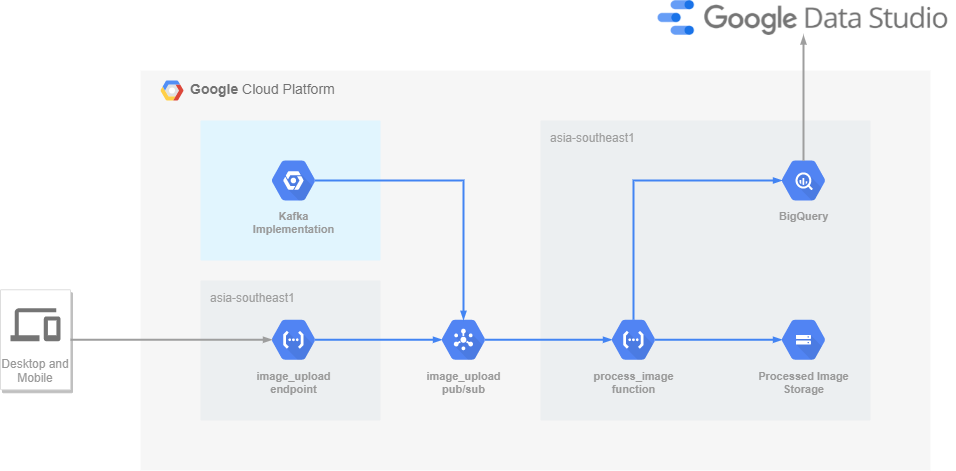

# Question 3
## Architecture Diagram

## Assumptions
### Question Related
- It is assumed that the sentence "The company would like to save processed images for a minimum of 7 days for archival purposes." means that only the post-processed images needs to be saved.
### Location Related
- It is assumed that the function is intended for usage within Singapore only and designed for a local context instead of for a global deployment
- It is aassumed that there is no legal reason however to constrain data flows to Singapore and as such default global resources such as Pub/Sub are not specially constrained although able to
### Processing Time Related
- It is assumed due to a lack of information on the processing time required for the image processing is able to fit within Cloud Functions runtime constraints and does not require special tooling, which would otherwise require running alternatives such as Kubernetes Engine